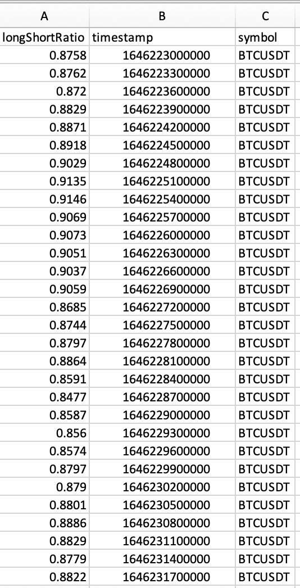

### Data Collection Test
---

#### 1. Objective 

Binance is a cryptocurrency exchange which is the largest exchange in the world in terms of daily trading volume of cryptocurrencies. 

In order to complete this task, you must retrieve the **Long Short Ratio Indicator** from Binance API.
This indicator represents the ratio between longs and shorts given a cryptocurrency on Binance during the past 30 days.

1. Binance API docs: https://binance-docs.github.io/apidocs/futures/en/#change-log

2. Long Short Ratio Section: https://binance-docs.github.io/apidocs/futures/en/#long-short-ratio

3. Endpoint: `/futures/data/globalLongShortAccountRatio`

4. Browser Request Example: https://fapi.binance.com/futures/data/globalLongShortAccountRatio?symbol=BTCUSDT&period=5m
 

#### 2. Output

The output of this task must be a .csv file containing **BTCUSDT 5 minute period Long Short Ratio Indicator** from Binance API over the **past 30 days**. More specifically the following columns from the API request, must be retrieved:

- longShortRatio
- timestamp
- symbol (BTCUSDT)

#### 3. Suggested Worflow

1. Analyze the request example from the Binance Docs
2. Make the request from your browser at first sight
3. Adapt the request to a python script (Use "**requests**" library)
4. Create a script that implements a logic to make multiple calls to the API, until the past 30 day data is retrieved. This is required, since the API does not allow to do it in a single one, due to the 500 limit.

6. You can create a dataframe for each call and concatenate it to a final one. Check pd.concat()

5. Export the final dataframe to a .csv file 

#### 4. Requirements

1. When using start_time and end_time request parameters, the input provided must be in **miliseconds** and in **Unix Timestamp**.

2. Use Python and Pandas to implement the logic (https://pandas.pydata.org/)

#### 5. Example of Expected Output

