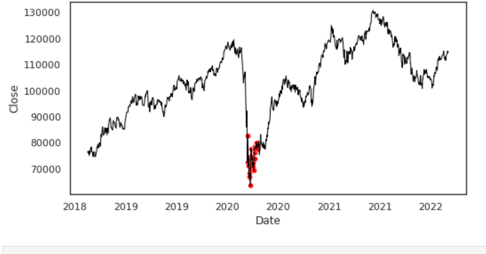

### Machine Learning Task

#### Objective

Anomalies are patterns in data that do not conform to a well-defined notion of normal behavior. Anomaly detection has been applied to many problems such as bank fraud, fault detection, noise reduction, among many others.

Aiming to detect unexpected bursts in stock markets, many statistical and machine learning approaches were
proposed.

Your first task is to use an unsupervised autoencoder neural network to detect anomalies in time series data.

#### Autoencoder Neural Network

An autoencoder is an unsupervised deep learning model that seeks to learn a compressed representation of its respective input.

#### Workflow 

1. Read the Time Series Dataframe 

2. Sort the dataframe by date on ascending order

3. Compute pairwise correlation of columns, using Pearson correlation method and plot the matrix.

4. Remove all features from the dataset, except Close price.

5. Scale the data

5. Preprocess the data, shaping it to look back 30 timesteps. (N_samples, Look_back, N_features) ex: (6000, 30,1)

6. Split the data into Train/Val/Test 70%/15%/15%. 

7. Feed the data into a LSTM autoencoder (Since it is an autoencoder, your target must be the same as your input). Use the Mean Absolute Error as the loss function. 

8. Plot the Close Price data containing the anomalies.

### Outputs Example

#### Link References

1. https://towardsdatascience.com/time-series-of-price-anomaly-detection-with-lstm-11a12ba4f6d9

2. https://www.youtube.com/watch?v=6S2v7G-OupA

3. https://sbic.org.br/wp-content/uploads/2021/09/pdf/CBIC_2021_paper_37.pdf

### Expected Output

You must provide a plot from the matrix of correlation scores, the plot of the detected anomalies on the test data from the time series, like the picture above, as well as the code used. 